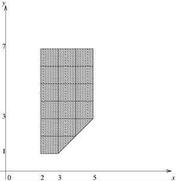
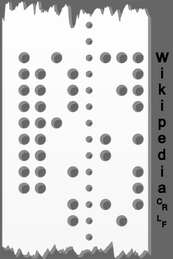

### Problem mz01-1: mz01-1

Напишите программу, проверяющую принадлежность точки на координатной плоскости заштрихованной фигуре, изображенной на рисунке.



Точки на границе фигуры считаются принадлежащими фигуре. Вершины фигуры находятся в точках с целочисленными координатами. Линии внутри фигуры показаны для удобства.

На стандартном потоке ввода задаются две строки, содержащие ровно по одному числу с плавающей точкой двойной точности: координаты x и y соответственно.

На стандартный поток вывода напечатайте число 1, если точка принадлежит фигуре, и 0, если точка не принадлежит фигуре.

**Examples**

_Input_

```
0  
0
```

_Output_

```
0
```

### Problem mz01-2: mz01-2

Раньше в качестве устройства ввода информации в компьютер использовались перфоленты. Пример устройства восьмибитной перфоленты с хранением символов в кодировке ASCII показан на картинке ниже. Большое отверстие в перфоленте означает, что соответствующий бит данных установлен в 1, а отсутствие отверстия означает 0. Будем считать, что самое правое отверстие соответствует младшему биту, а биты нумеруются от 0 (младший бит) до 7 (старший бит восьмибитного кода). Маленькие отверстия являются служебными и используются лентопротяжным механизмом.



В некотором устройстве хранения информации используются 6-битные перфоленты. 6 бит данных достаточно для хранения 64 символов. Цифры '0' - '9' кодируются на перфоленте кодами 1 - 10, далее идут строчные латинские буквы 'a' - 'z' (в алфавитном порядке), далее идут коды заглавных латинских букв 'A' - 'Z' (в алфавитном порядке). Коды 0 и 63 зарезервированы.

К сожалению, устройство чтения перфолент оказалось частично неисправным. Считыватель бита с номером 3 испортился и вместо наличия отверстия показывает ее отсутствие, а вместо отсутствия — наличие. Считыватель бита 2 засорился и всегда показывает отсутствие отверстия. По содержимому ленты, записанному в виде последовательности символов в кодировке ASCII, определите последовательность символов, которая будет прочитана неисправным устройством чтения.

На стандартном потоке ввода задаются символы, записанные на ленте. Для представления символов используется кодировка ASCII. Поток символов завершается признаком конца файла. В потоке символов все символы, не являющиеся латинскими заглавными или строчными буквами или цифрами должны игнорироваться.

На стандартный поток вывода выведите последовательность символов, которая будет прочитана неисправным устройством чтения. Для вывода используйте кодировку ASCII. Для вывода кода 0 перфоленты используйте символ '@', а для вывода кода 63 - символ '#'.

**Examples**

_Input_

```
ALPHA
+
beta
.
```

_Output_

```
ETTvE@2h2
```

### Problem mz01-3: mz01-3

Пусть дано некоторое простое число N (N > 1). Для любых двух чисел a и b (0 ≤ a, b < N) их произведение по модулю N определяется как остаток от деления произведения a и b на N. Запишем это как c ≡ a * b (mod N). Пусть даны любые c (0 ≤ c < N) и a (0 < a < N). Тогда существует единственное b, такое что c ≡ a * b (mod N). Число b назовем результатом деления по модулю N числа c на число a. Запишем это как b ≡ c / a (mod N).

На стандартный поток вывода напечатайте таблицу деления для некоторого фиксированного простого числа N.

На стандартном потоке ввода задается единственное целое простое число N (N < 2000).

На стандартный поток вывода напечатайте таблицу деления, которая состоит из N строк и N - 1 столбцов, где строка соответствует делимому, а столбец - делителю. Столбцов выводится N - 1, так как столбец, соответствующий делителю 0 пропускается.

В примере ниже показана таблица для N = 5. В первой строке наблицы находятся результаты деления числа 0 на 1, 2, 3, 4 соответственно. В последней строке таблицы находятся результаты деления числа 4 на 1, 2, 3, 4 соответственно. В самом деле, 4 / 3 ≡ 3 (mod 5), так как 3 * 3 ≡ 4 (mod 5).

**Examples**

_Input_

```
5
```

_Output_

```
0 0 0 0
1 3 2 4
2 1 4 3
3 4 1 2
4 2 3 1
```

### Problem mz01-4: mz01-4

Напишите функцию ```sort_even_odd``` с прототипом.

```c
void sort_even_odd(size_t count, int *data)
```

функция должна отсортировать массив так, чтобы сначала в нем шли четные числа по неубыванию, потом нечетные числа по невозрастанию.

### Problem mz01-5: mz01-5

По данному числу N выведите все перестановки чисел от 1 до N в лексикографическом порядке.

Задано 1 число: N (0<N<10).

Необходимо вывести все перестановки чисел от 1 до N в лексикографическом порядке. Перестановки выводятся по одной в строке, числа в перестановке выводятся без пробелов.

**Examples**

_Input_

```
3
```

_Output_

```
123
132
213
231
312
321
```
